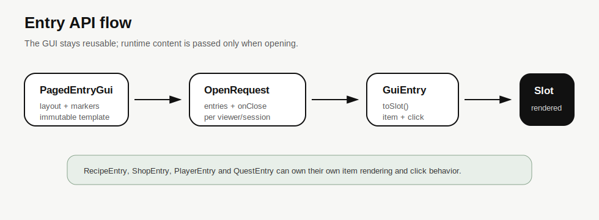
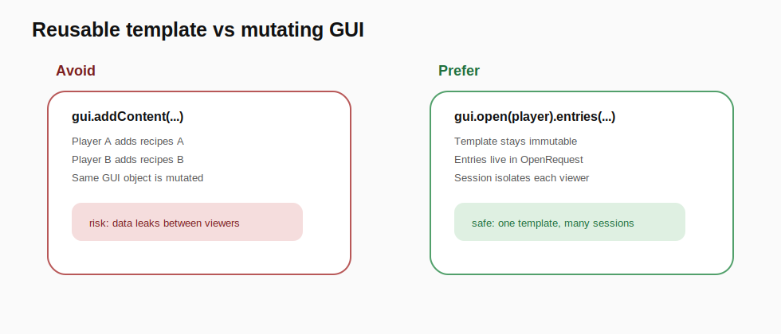

# DadaGUI Entry API

La Entry API è il livello più user-friendly per contenuti complessi.

Serve quando un oggetto non è solo un dato da renderizzare con un renderer esterno, ma una piccola unità GUI completa:

```text
entry = item visuale + comportamento click
```

È pensata per casi come:

- ricette craftabili;
- oggetti shop;
- player list;
- quest/reward;
- kit;
- elementi configurabili;
- item migrati da vecchi framework basati su `AbstractItem`.

---

## Problema risolto

Nel vecchio stile potevi scrivere:

```java
PagedGUI gui = crafting.getGUI();
validRecipes.forEach(recipe -> gui.addContent(new RecipeItem(context, recipe)));
gui.addCloseConsumer((igui, guiContext) -> crafting.finishBusy());
gui.open(new GUIContext(context.getPlayer()));
```

Questo è comodo, ma può essere pericoloso perché `addContent` modifica la GUI stessa.
Se due giocatori aprono la stessa GUI nello stesso momento, i dati possono mischiarsi.

DadaGUI separa:

```text
Gui        = template riutilizzabile
OpenRequest = dati di quella apertura
Session    = stato runtime del viewer
```

---

## Soluzione

Definisci una volta il template:

```java
PagedEntryGui<Player, ItemStack> recipeGui = DadaGui.<Player, ItemStack>pagedEntries('x')
        .title("Pick The Recipe To Craft")
        .layout(
                "# # # # # # # # #",
                "# x x x x x x x #",
                "# # # < # > # # C")
        .ingredient('#', ingredients.filler(MaterialKey.BLACK_STAINED_GLASS_PANE))
        .ingredient('<', navigation.previousPage())
        .ingredient('>', navigation.nextPage())
        .ingredient('C', navigation.close())
        .scope(GuiScope.PER_PLAYER)
        .pageMode(PageMode.PER_PLAYER)
        .build();
```

Poi, quando devi aprire:

```java
recipeGui.open(context.getPlayer())
        .entries(validRecipes, (recipe, index) -> new RecipeEntry(context, recipe, ingredients))
        .onClose(session -> crafting.finishBusy())
        .show(guiManager);
```

---

## RecipeEntry

```java
public final class RecipeEntry implements GuiEntry<Player, ItemStack> {
    private final Context context;
    private final Recipe recipe;
    private final BukkitIngredients ingredients;

    public RecipeEntry(Context context, Recipe recipe, BukkitIngredients ingredients) {
        this.context = context;
        this.recipe = recipe;
        this.ingredients = ingredients;
    }

    @Override
    public GuiSlot<Player, ItemStack> toSlot(GuiRenderContext<Player, ItemStack> renderContext, int slotIndex) {
        ItemStack item = resolveRecipeItem(recipe);

        return GuiSlot.<Player, ItemStack>builder(item)
                .button()
                .onClick(click -> {
                    context.getCrafting().craft(context, recipe);
                    click.close();
                })
                .build();
    }
}
```

---

## Entry rapida senza classe dedicata

Per casi piccoli puoi usare la factory di `BukkitIngredients`:

```java
quickShop.open(player)
        .entries(items, (item, index) -> ingredients.entry(
                item,
                value -> ingredients.stack(value.icon(), 1,
                        "§f" + value.displayName(),
                        "§7Price: §e" + value.price()),
                (click, value) -> {
                    shopService.buy(click.viewer(), value);
                    click.close();
                }))
        .show(guiManager);
```

---

## Pattern applicati

| Pattern | Dove viene usato | Perché |
|---|---|---|
| Facade | `DadaGui` | API breve e leggibile |
| Builder | `pagedEntries(...)` | composizione fluente della GUI |
| Strategy | `GuiEntry#toSlot` | ogni entry decide come disegnarsi |
| Command | `onClick(...)` | azione click incapsulata |
| Adapter | `GuiEntry` / `ingredients.entry(...)` | migrazione da vecchi AbstractItem |
| Composition | `GuiSlot` HAS-A `SlotBehavior` | estendibilità senza gerarchie rigide |

---

## Diagrammi




