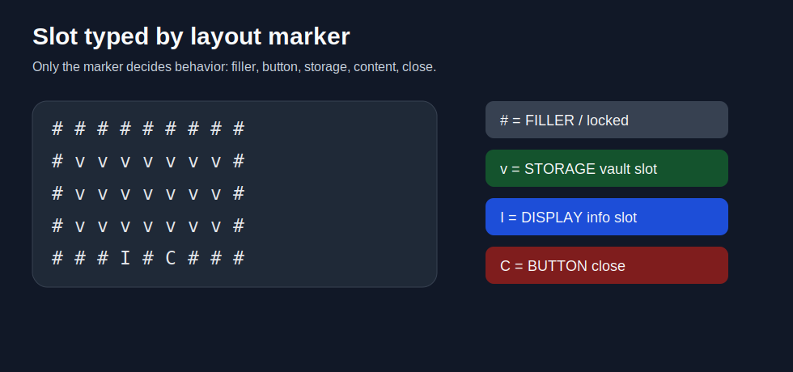
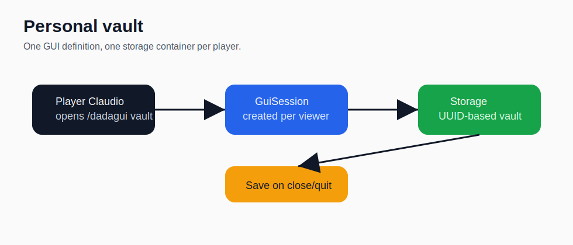
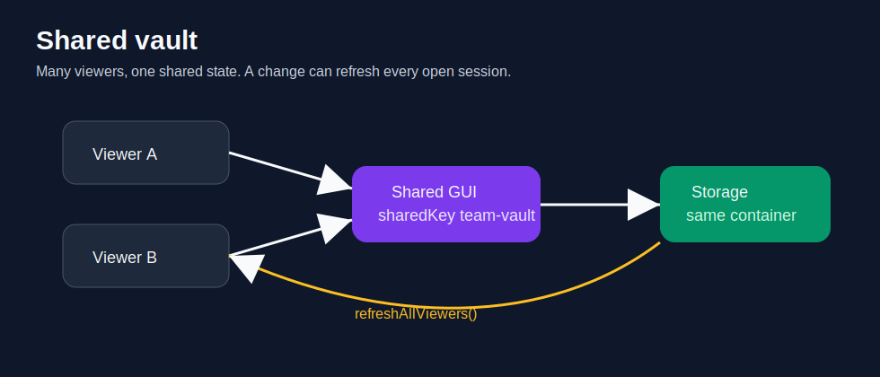
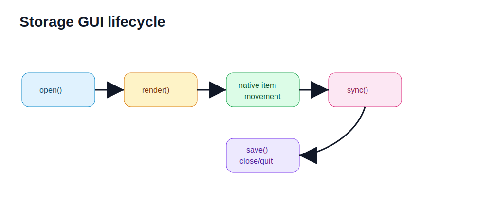
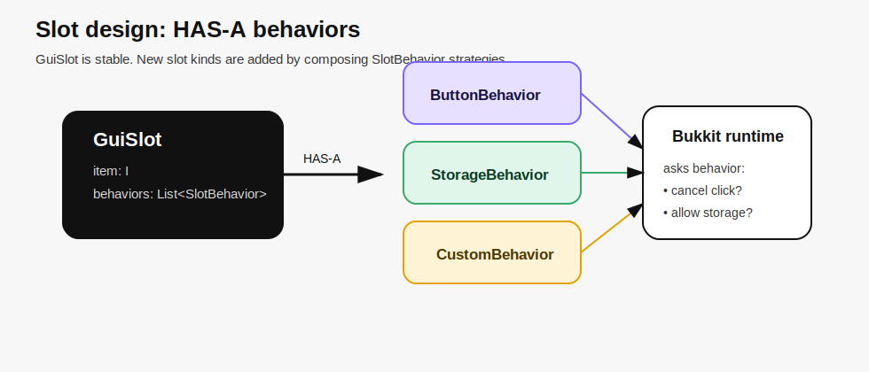

# DadaGUI Use Cases

## 1. Mixed slot GUI

A single layout can mix different slot behaviors without service-heavy code.



```java
Gui<Player, ItemStack> vault = DadaGui.<Player, ItemStack>storage('v')
        .title(player -> "Vault | " + player.getName())
        .layout(
                "# # # # # # # # #",
                "# v v v v v v v #",
                "# v v v v v v v #",
                "# v v v v v v v #",
                "# # # I # C # # #")
        .ingredient('#', ingredients.filler(MaterialKey.BLACK_STAINED_GLASS_PANE))
        .ingredient('I', ingredients.display(MaterialKey.BOOK, "Info"))
        .ingredient('C', navigation.close())
        .storageProvider(context -> repository.personal(context.viewer().getUniqueId()))
        .onSave((session, storage) -> repository.savePersonal(session.viewer().getUniqueId(), storage))
        .scope(GuiScope.PER_PLAYER)
        .build();
```

## 2. Personal vault

Each viewer gets a different storage container while using the same GUI definition.



Use this for:

- personal vaults;
- backpacks;
- private reward storage;
- player-specific containers.

## 3. Shared vault

Multiple viewers can open the same GUI and edit the same backing storage.



Use this for:

- team vaults;
- faction chests;
- shared shop storage;
- staff/event containers.

## 4. Storage lifecycle

The Bukkit runtime synchronizes mutable storage slots before refresh, close, quit and plugin shutdown.



Important runtime behavior:

- filler/display/button slots are protected;
- storage slots allow native item movement;
- drag over non-storage slots is cancelled;
- shift-click from the player inventory is cancelled by default to avoid uncontrolled placement;
- storage is synchronized and saved on close/quit/shutdown.


## 5. Extensible slot behaviors

Enums are useful as builder presets, but they should not be the extension model.
DadaGUI uses composition: a `GuiSlot` has one or more `SlotBehavior` strategies.



```java
public final class ConfirmBehavior implements SlotBehavior<Player, ItemStack> {
    @Override
    public String key() {
        return "my-plugin:confirm";
    }

    @Override
    public boolean shouldCancelClick(ClickContext<Player, ItemStack> context) {
        return true;
    }

    @Override
    public void onClick(ClickContext<Player, ItemStack> context) {
        context.viewer().sendMessage("Confirm clicked");
    }
}
```

Use it without touching framework internals:

```java
.ingredient('K', ingredients.fixed(keyItem, new ConfirmBehavior()))
```

This keeps the framework:

- low-coupled: the runtime does not know plugin-specific slot types;
- high-cohesion: each behavior owns one responsibility;
- open for extension: new behavior classes can be added by plugin code;
- closed for modification: no central enum/switch must be edited.
